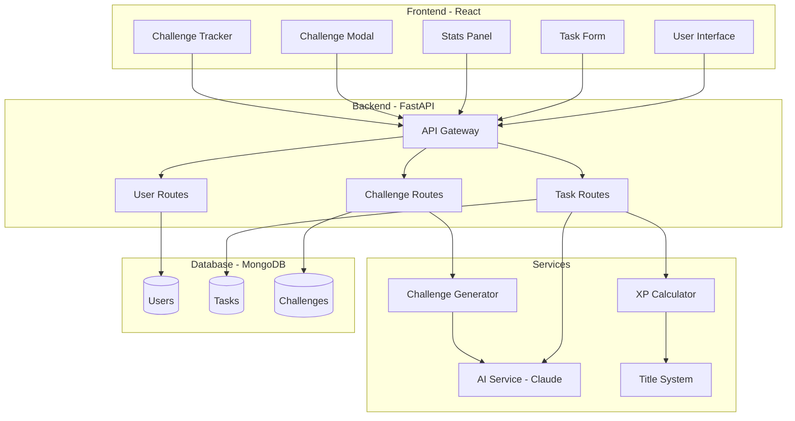
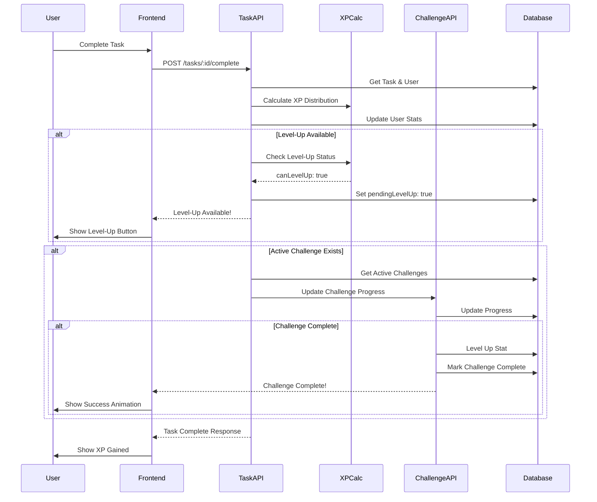
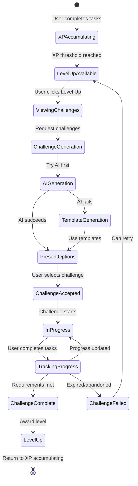
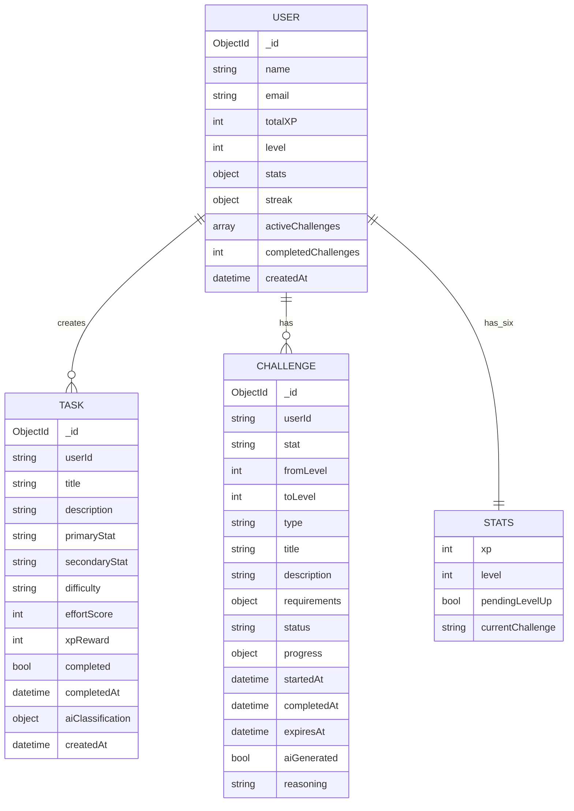
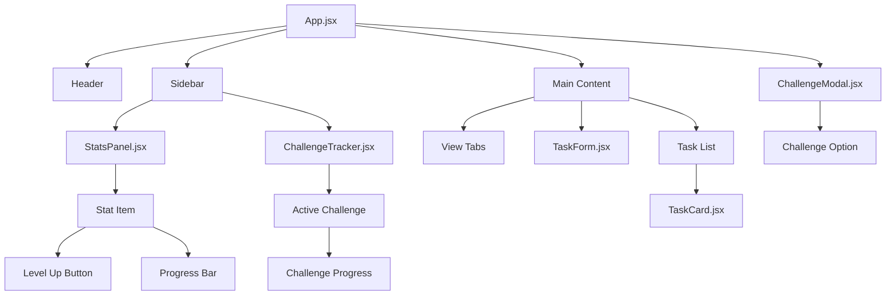
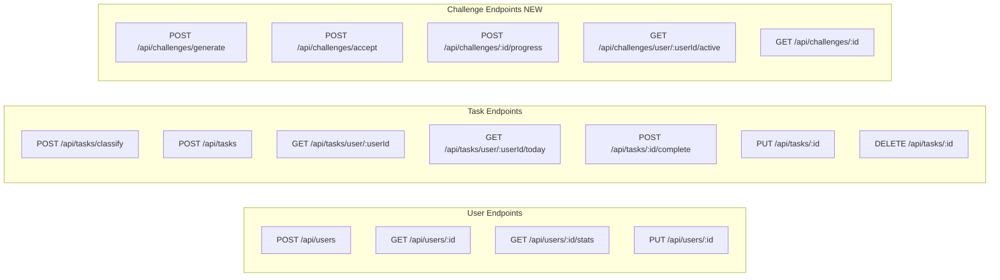
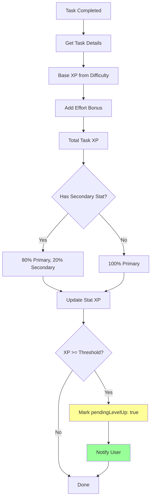
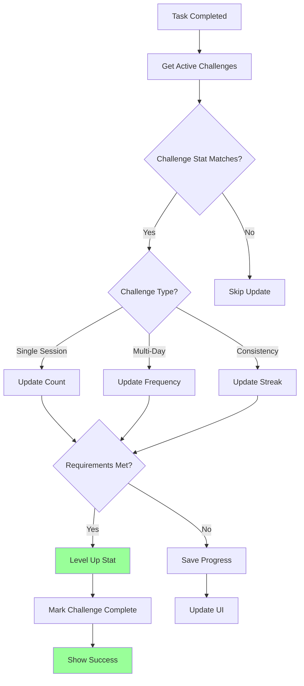
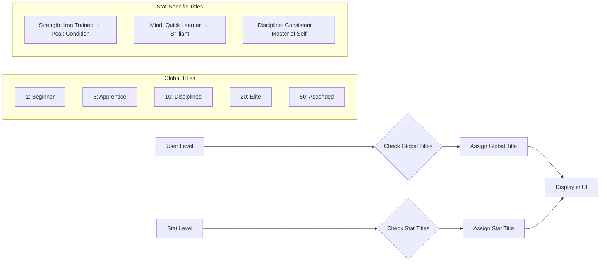

# 🏗️ LevelUp System Architecture

## System Overview

## Data Flow: Task Completion with Challenge System

## Challenge System Flow

## Database Schema

## Component Hierarchy

## API Endpoints Structure

## XP Calculation Flow

## Challenge Progress Tracking

## Title System Logic

---

## Key Design Decisions

### 1. Level Gating Mechanism
- XP accumulates normally
- Level-up **requires** challenge completion
- Prevents passive progression
- Creates meaningful milestones

### 2. Challenge Types
- **Single Session**: Complete in one go
- **Multi-Day**: Frequency over time period
- **Consistency**: Maintain streaks

### 3. AI Integration Points
- Task classification (existing)
- Challenge generation (new)
- Fallback to templates if AI fails

### 4. Progress Tracking
- Real-time challenge progress updates
- Automatic detection when tasks contribute to challenges
- Clear visual feedback in UI

### 5. Data Integrity
- Completed tasks cannot be deleted (preserve XP history)
- Challenges have expiration dates
- Failed challenges can be retried

---

## Performance Considerations

### Caching Strategy
- Cache AI-generated challenges for similar level-ups
- Cache title lookups
- Minimize database queries with aggregation

### Scalability
- Index on userId + status for challenges
- Index on stat + level for quick lookups
- Paginate task lists

### Error Handling
- Graceful AI fallback to templates
- Transaction-like updates for level-ups
- Rollback capability for failed operations

---

**This architecture supports the production-grade LevelUp system with robust challenge mechanics and scalable design.**